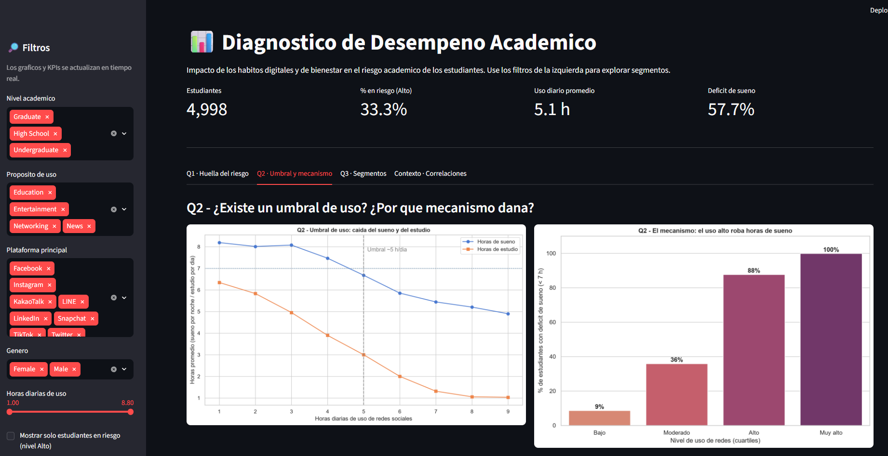

# TPI — Diagnóstico de Desempeño Académico

Sistema de análisis y visualización de datos que diagnostica el desempeño académico de
estudiantes, identifica factores de riesgo y propone soluciones basadas en evidencia, a
partir de sus hábitos digitales y de bienestar.

El proyecto cubre el ciclo completo de datos: **ETL** (carga, limpieza y *feature
engineering*) en [etl.py](etl.py), **visualización** en [plots.py](plots.py) y un
**dashboard interactivo** en [app.py](app.py) construido con Streamlit.

### Vista previa del dashboard



---

## Contexto del proyecto

### El dataset

**Student Social Media and Mental Health Impact** — un dataset de analítica del
comportamiento con **5.000 registros** de estudiantes, diseñado para explorar la relación
entre el uso de redes sociales, los hábitos de vida y el bienestar mental.

A medida que las redes sociales moldean la vida diaria de los estudiantes, entender su
efecto sobre el sueño, los hábitos de estudio, el estrés y la salud mental es cada vez más
importante. El dataset ofrece una representación realista del comportamiento estudiantil y
sirve para análisis exploratorio, modelado predictivo y desarrollo de dashboards.

- **Registros:** 5.000 · **Formato:** CSV (tabular) · **Licencia:** CC BY 4.0
- **Dominio:** redes sociales, educación, salud mental
- **Fuente:** [Kaggle — Student Social Media And Mental Health Impact](https://www.kaggle.com/datasets/shivasingh4945/student-social-media-and-mental-health-impact/data)
- **Archivo:** [Student Social Media And Mental Health Impact.csv](Student%20Social%20Media%20And%20Mental%20Health%20Impact.csv)
- **Colab:** [Student Social Media And Mental Health Impact.csv](https://colab.research.google.com/drive/17IVnjQRrbHQYyJ3TDFTbzO-o2026l0yW?usp=sharing)

| Grupo | Variables |
|-------|-----------|
| **Demográficas** | `Age` (edad), `Gender` (género), `Country` (país), `Academic_Level` (nivel educativo) |
| **Hábitos digitales** | `Most_Used_Platform` (plataforma principal), `Purpose_Of_Use` (propósito de uso), `Avg_Daily_Usage_Hours` (horas diarias de uso), `Daily_Unlocks` (desbloqueos diarios del dispositivo) |
| **Estilo de vida** | `Study_Hours` (horas de estudio), `Physical_Activity_Hours` (actividad física), `Sleep_Hours_Per_Night` (horas de sueño) |
| **Salud mental** | `Stress_Level` (nivel de estrés autorreportado), `Mental_Health_Score` (puntaje de bienestar mental) |

> **Nota de planteo:** el dataset no trae una variable directa de calificación, abandono o
> desempeño. El **riesgo académico** se construye como una variable calculada
> (*Índice de Riesgo Académico*) a partir de `Study_Hours`, `Stress_Level` y
> `Mental_Health_Score`, durante el *feature engineering* (ver [etl.py](etl.py)).

### Las 3 preguntas de negocio

1. **La huella digital del riesgo.** ¿Qué combinación de hábitos digitales (horas de uso,
   desbloqueos, plataforma y propósito) caracteriza al estudiante en **riesgo académico**?
2. **El umbral y el mecanismo.** ¿Existe un **umbral de horas diarias** de redes a partir
   del cual se desploman el sueño y el estudio? ¿El daño viene más por **desplazar el
   estudio** o por **robar horas de sueño**?
3. **Segmentos más expuestos.** A **igualdad de horas de uso**, ¿qué segmentos —por nivel
   académico, propósito y plataforma— concentran mayor proporción de estudiantes en riesgo?

**Hilo narrativo:** *¿quiénes están en riesgo y qué hábito los delata (Q1) → por qué
mecanismo el exceso los daña (Q2) → en qué segmentos intervenir primero (Q3)?*

---

## Estructura del proyecto

| Archivo / carpeta | Rol |
|-------------------|-----|
| [etl.py](etl.py) | Pipeline de datos: carga, limpieza y *feature engineering*. Funciones puras y reutilizables. |
| [plots.py](plots.py) | Genera los gráficos (matplotlib + seaborn) que responden cada pregunta. |
| [app.py](app.py) | Dashboard interactivo en Streamlit con filtros, KPIs y pestañas por pregunta. |
| [ETL.ipynb](ETL.ipynb) | Notebook con el análisis exploratorio y la justificación de cada paso. |
| `Student Social Media And Mental Health Impact.csv` | Dataset crudo (entrada). |
| `dataset_procesado.csv` | Dataset limpio y con features (salida del pipeline). |
| `graficos/` | Gráficos exportados para el informe. |
| `requirements.txt` | Dependencias del proyecto. |

---

## Cómo levantarlo

### Requisitos
- Python 3.10 o superior

### 1. Crear y activar el entorno virtual

```powershell
python -m venv .venv
.\.venv\Scripts\Activate.ps1      # Windows (PowerShell)
```

> En Linux/macOS: `source .venv/bin/activate`
>
> Si PowerShell bloquea la activación por *execution policy*, ejecutá una sola vez:
> `Set-ExecutionPolicy -Scope CurrentUser RemoteSigned`

Con el entorno activo verás `(.venv)` al inicio de la línea de comandos.

### 2. Instalar dependencias

```powershell
pip install -r requirements.txt
```

### 3. (Opcional) Regenerar el dataset procesado

El dashboard ya funciona con `dataset_procesado.csv`. Si querés regenerarlo desde el CSV
crudo, corré el pipeline:

```powershell
python etl.py
```

### 4. Ejecutar el dashboard

```powershell
streamlit run app.py
```

Se abrirá automáticamente en el navegador (por defecto en `http://localhost:8501`). Para
detenerlo, presioná `Ctrl + C` en la terminal. Para salir del entorno virtual: `deactivate`.
